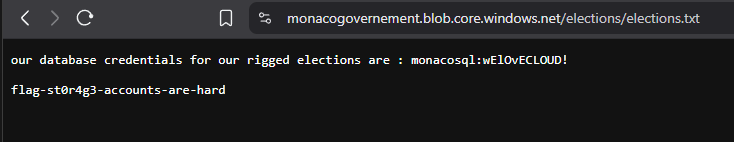
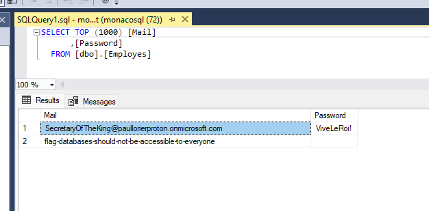
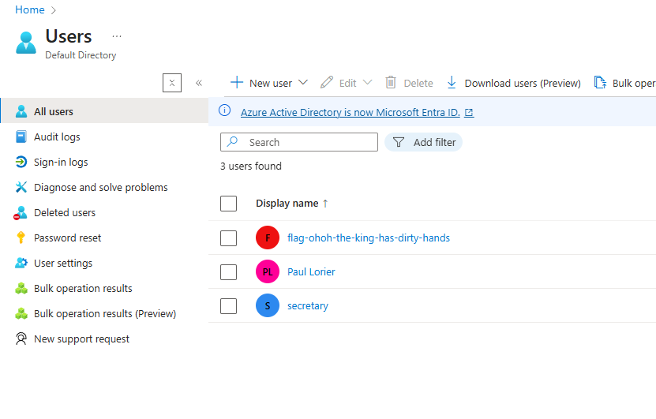

# Vol en côte d'Azure 1

Catégorie: Infonuagique

```
Vous venez d'atterir en pleine côte d'Azure, pensant vous reposez sur la plage. Cependant, le climat là-bas est tendu, et tout le monde parle d'élections truquées. Vous décidez d'enqêter la dessus, essayant de trouver des fichiers compromettants, avec le peu d'informations que vous avez. Les informations que vous avez sont : le gouvernement utilise le mots clé monacogovernement pour les élections, et une liste de mots clés pour les élections.
---
You just landed in the middle of Azure, thinking you're on the beach. However, the weather there is tense, and everyone is talking about rigged elections. You decide to investigate, trying to find compromising files, with the little information you have. The information you have is : the government uses the keyword monacogovernement for the elections, and a list of keywords for the elections.
```


On nous donne un nom `monacogovernement` et une liste de mots, plus la forte mention de Azure dans l'énoncé.

En utilisant `MicroBurst`, une suite d'outils de pentesting pour Azure, on peut énumérer les services qui pourrait utiliser ce nom.

```powershell
> Invoke-EnumerateAzureSubDomains -Base monacogovernement -Verbose
VERBOSE: Found monacogovernement.table.core.windows.net
VERBOSE: Found monacogovernement.blob.core.windows.net
VERBOSE: Found monacogovernement.queue.core.windows.net
VERBOSE: Found monacogovernement.file.core.windows.net
VERBOSE: Found monacogovernement.database.windows.net

Subdomain                                Service
---------                                -------
monacogovernement.database.windows.net   Databases-MSSQL
monacogovernement.blob.core.windows.net  Storage Accounts - Blobs
monacogovernement.file.core.windows.net  Storage Accounts - Files
monacogovernement.queue.core.windows.net Storage Accounts - Queues
monacogovernement.table.core.windows.net Storage Accounts - Tables
```

On peut ensuite essayer d'énumérer les fichier dans les différentes solutions de stockages trouvées.

```powershell
> Invoke-EnumerateAzureBlobs -base monacogovernement -Folder ..\..\Azure\election_wordlist.txt
Found Storage Account - monacogovernement.blob.core.windows.net
Found Container - monacogovernement.blob.core.windows.net/elections
        Public File Available: https://monacogovernement.blob.core.windows.net/elections/elections.txt
```



# Vol en côte d'Azure 2

```
Maintenant que vous avez trouvé les informations compromettantes, continuez votre enquête.
---
Now that you've found the compromising information, continue your investigation.
```

Dans le même fichier que le flag 1, il y a un identifiant pour se connecter à une base de donnée, et lorsqu'on a énumérés les services, l'un d'eux était une DB.

En utilisant Microsoft SQL Server Management Studio, on peut trouver le flag dans la seule table de la base de données.



# Vol en côte d'Azure 3
```
Finissez votre enquête.
---
Finish your investigation.
```

Dans la base de données se trouve un autre identifiant, celui-ci étant un identifiant d'utilisateur Azure, on peut se connecter au portail directement.
En parcourant les derniers services utilisés, on peut trouver le dernier flag dans la sections Users.


