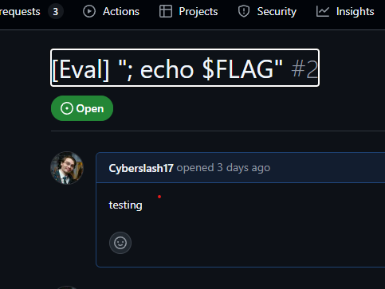

# D-8 GitHub Workflows - Bangladesh

## Intro

Pour cette track, un repo Github read-only avec des [Github Actions workflows](https://docs.github.com/en/actions).
Chaque workflow constitue un des challenges de la track et ont tous comme but d'extraire le flag des Secrets du workflow et suit généralement l'ordre suivant:

1. Trouver comment activer le workflow
2. Trouver la faille dans le workflow
3. Executer l'exploit.


Note: Github cache les secrets et certaines transformations connue (ex. hex, base64) des logs par défault.

# Challenge

Le premier challenge de la track D8:

```yaml
name: Bangladesh
on:
  issues:
    types:
      - opened
      - edited

permissions: 
  contents: read
  actions: write

jobs:
  dhaka:
    if: contains(github.event.issue.title, '[Eval]') 
    runs-on: ubuntu-latest
    env:
      FLAG: ${{ secrets.FLAG_BANGLADESH }}
      GH_TOKEN: ${{ secrets.GITHUB_TOKEN }}
    timeout-minutes: 5
    steps:
      - name: Checkout
        uses: actions/checkout@v4
      - uses: actions/setup-python@v5
        with:
          python-version: 3.12
          cache: pip
      - run: pip install -r requirements.txt
      - name: Eval issue
        run: python eval_issue.py
        id: issue
        env:
          PR_AUTHOR: ${{ github.actor }}
          PR_TITLE: ${{ github.event.issue.title }}
      - name: Generate report on body change
        run: |
          echo "${{ steps.issue.outputs.comment_body }}" > report.txt
      - name: Upload Result
        uses: actions/upload-artifact@v4
        with:
          name: eval-result
          path: report.txt

```


### Trouver comment activer le workflow

Si on se fit à aux lignes suivantes, le workflow s'active quand un Github issues ayant `[Eval]` dans le titre est ouverte ou éditée. 

```yaml

on:
  issues:
    types:
      - opened
      - edited

...

if: contains(github.event.issue.title, '[Eval]') 
```


### Trouver la faille dans le worflow

Chaque fois qu'il est lancé, le workflow execute le code suivant en injectant le titre de l'issue dans une variable d'environment appeler `PR_TITLE`

```python
import os

pr_author = os.getenv('PR_AUTHOR')
pr_title = os.getenv('PR_TITLE')
template = f'Pull request <{pr_title}> was created by {pr_author}.'
if 'GITHUB_OUTPUT' in os.environ:
    with open(os.environ['GITHUB_OUTPUT'], 'a') as f:
        print(f"comment_body={template}", file=f)

```

Ce script créer le message suivant qui est ensuite passé à l'autre étape du workflow au travers de `GITHUB_OUTPUT`.

`Pull request MyGithubIssue was created by Cyberslash17.`

### Exploit

À l'étape suivante, ce message est injecté directement dans la commande:

```sh
echo "${{ steps.issue.outputs.comment_body }}" > report.txt
```

Puisque le message est ajouté tel-quel, on peut manipuler le titre de l'issue pour executer du code et extraire le secret:



Il suffit ensuite de télécharger l'archive report.txt générée par l'action pour avoir le flag.


---
## Flag:

`flag-bangladesh-ec1ec9022f3c>`
