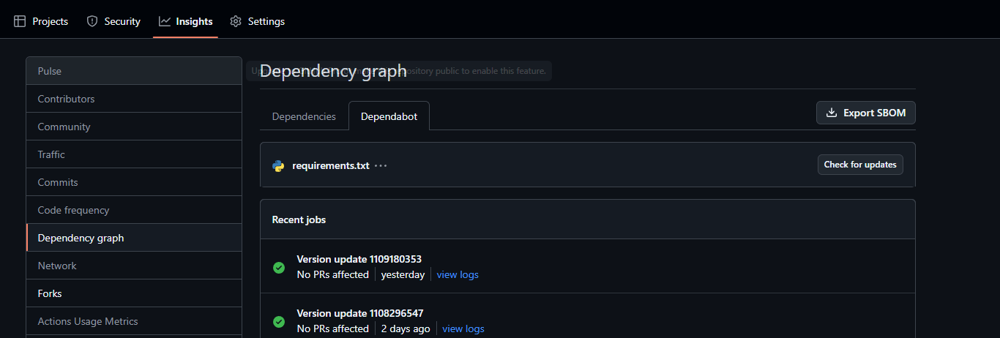
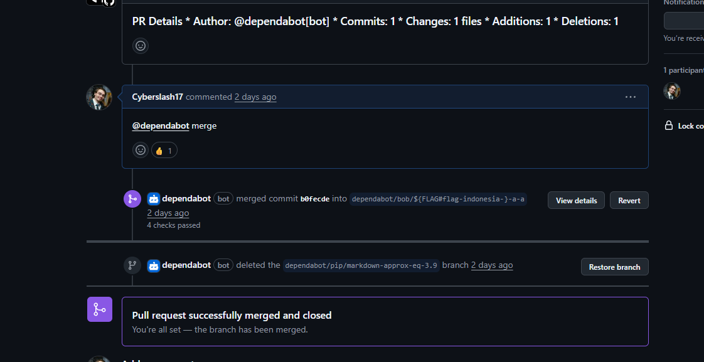
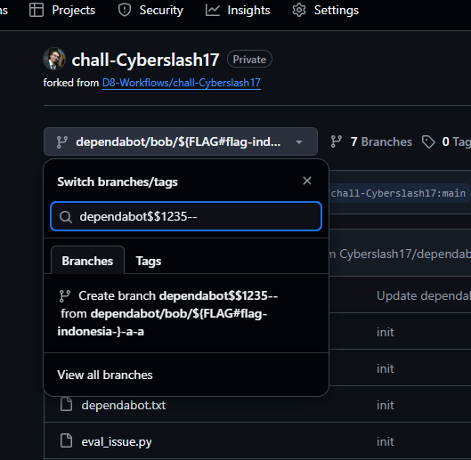
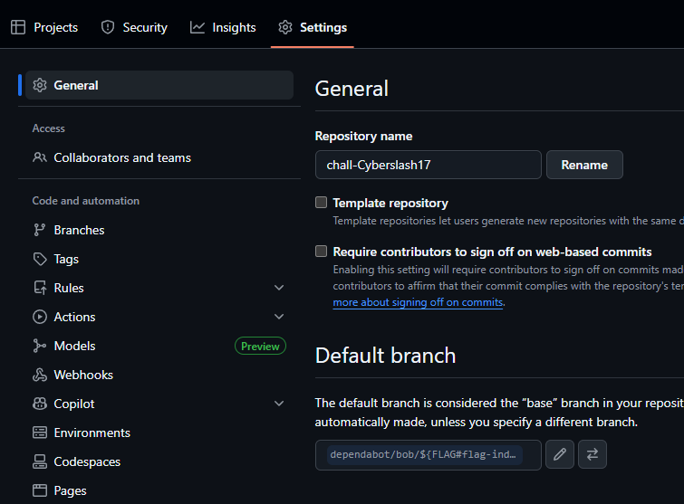

# D-8 GitHub Workflows - Indonesia

## Intro

Pour cette track, un repo Github read-only avec des [Github Actions workflows](https://docs.github.com/en/actions).
Chaque workflow constitue un des challenges de la track et ont tous comme but d'extraire le flag des Secrets du workflow et suit généralement l'ordre suivant:

1. Trouver comment activer le workflow
2. Trouver la faille dans le workflow
3. Executer l'exploit.

Note: Github cache les secrets et certaines transformations connue (ex. hex, base64) des logs par défault.

# Challenge

Le challenge de la track D8:

```yaml
name: Indonesia
on:
  pull_request_target:
    types:
      - opened
      - synchronize

permissions: 
  contents: read

jobs:
  jakarta:
    if: github.event.sender.login == 'dependabot[bot]'
    runs-on: ubuntu-latest
    timeout-minutes: 5
    env:
      FLAG: ${{ secrets.FLAG_INDONESIA }}
      GH_TOKEN: ${{ secrets.GITHUB_TOKEN }}
    steps:
      - name: Checkout
        uses: actions/checkout@v4
        with: 
          repository: ${{ github.repository }}
          ref: ${{ github.event.pull_request.head.sha }}
      - name: Report
        run: |
          DEP_NAME=$(echo "${{ github.event.pull_request.head.ref }}" | awk -F'/' '{print $3}' | awk -F'-' '{print $1}')
          NEW_VERSION=$(echo "${{ github.event.pull_request.head.ref }}" | awk -F'-' '{print $2}')
          
          sed -e "s/{{DEP_NAME}}/$DEP_NAME/g" \
              -e "s/{{NEW_VERSION}}/$NEW_VERSION/g" \
              dependabot.txt

```

### Trouver comment activer le workflow

Celui-ci est un peu plus long que les autres à mettre en place.

Ce workflow s'execute lors de nouveau commits dans une PR seulement si créer par dependabot. Dependabot est un bot intégrer à Github servant à gérer les dépendances de projets (SBOM).
Lorsqu'il détecte que des dépendances sont en retard ou s'il y a une version vulnérable, il ouvrira automatiquement une PR pour y remédier.

Puisque nous n'avons pas accès au repo principale, il faut trouver un moyen de forcer dependabot à pousser un commit dans une branche ayant une PR vers le repo principal ouverte.

1. Pour activer dependabot, il faut aller dans Security -> Overview -> Dependabot alerts.
2. Ajouter un nouveau commit à la branche principale (ex. main) changeant une dépendance à une version moins récente ex. `markdown~=2.6.1` dans `requirements.txt`.
3. Ouvrir une PR de la branche principale vers le repo principale.
4. Forcer dependabot à scanner le fork. Pour ce faire, il faut aller dans `Insights` -> `Dependency graph` -> `Dependabot` -> `Recent update jobs` -> `Check for updates`



5. Utiliser les commandes de dependabot pour qu'il merge la PR (cela va créer un commit de dependabot dans la branche principale)



Si tout est bien configurer, cela devrait lancer le workflow.

### Exploit

Maintenant qu'on a accès au workflow, il faut l'exploiter. De tout les champs qu'utilise le workflow, le seul exploitable est le nom de la branche à partir duquel la PR est créée. Malheureusement, git limite les caractères que l'ont peux utiliser dans une branche (tel que `$`). 

Par contre, Github étant créer par dessus git, certaines fonctionnalités ne sont pas totalement alignés. C'est le cas du menu de branche du UI de Github, si on entre un nom d'une nouvelle branche, on aura l'option de créer une nouvelle branche et cet option permet beaucoup plus de caractères que git.



Donc la solution est la suivante:

1. Créer une nouvelle branche appelée `dependabot/bob/${FLAG#flag-}`
2. Changer la branche principale du fork pour la nouvelle branche

3. Créer un nouveau commit dans la branche et changer une dependence à une version plus vieille
4. Créér une PR vers le repo original
5. Forcer un scan de dependabot
6. Demander à dependabot de merge la PR
7. Lire les logs du workflow et extraire les partie du flag.

| Package | From | To |
|---|---|---|
| `indonesia` | `{{CURRENT_VERSION}}` | `68a79b1c7d55` |

---
## Flag:

`flag-indonesia-68a79b1c7d55`
